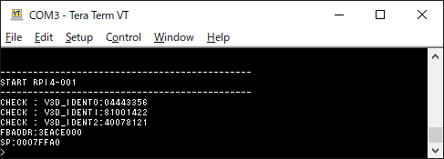

# Raspberry PI 4 Model B0 Baremetal Programming sandbox.

## About

Baremetal programming sandbox for RPI4.

## sample uart0

uart output sample.

## sample v3d_power_on

V3D block power on sample for RPI4.

## Sample program LICENSE

MIT License
https://opensource.org/licenses/mit-license.php

## AStyle options

http://astyle.sourceforge.net/

astyle <sources> --indent=tab --style=linux --indent=force-tab --indent-after-parens --indent-col1-comments --pad-header --pad-oper

## Author

gyabo(aka yasai kumaashi)

